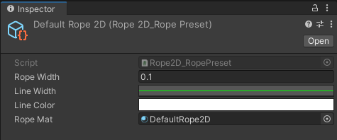

# Mazurka 2D Ropes Tool

>**Mazurka-Rope2D** is a physic-based **rope tool** for Unity. Simulation is base on verlet algorithm. 
You can use ropes in 2D/2.5D games (work in 3D too).
Mazurka 2D Ropes are **visual only**, rope nodes can't interact with world 2D Colliders.
 

<!--- CONTEXT MENU--->

___

### Ropes

There is two type of ropes : 
1. SimpleRope : *One constraint rope, can be attach to a Rigibody2D.*
2. BridgeRope : *Two constraint rope, can be attach to two Rigidbody2D.*

<!--- ROPE TYPE --->

___

When using **BridgeRope**, the **tension** is calculated and you can choose if the rope **stretches** or if the rope should **break**. 
When a BridgeRope breaks, it will be converted to a SimpleRope. You can easily transform a SimpleRope to a BridgeRope too.

<!--- ROPE TENSION --->

___

The rope inspector allow you to edit all the rope parameters. You can edit physic simulation, rope type, rope constraint points, rope visual preset and more... 
 
You can simulate the rope in editor to check your settings or to "prebuilt" the rope to avoid simulation in runtime (you need uncheck simulate toggle only for in-game static ropes).

<!--- INSPECTOR --->

___

The rope preset scriptable, allow you to use same visual settings over mutliple ropes. You can edit rope width, color, material and width over line renderer.

<!--- PRESET --->

___

### Rope Objects

>Rope objects is an extension for tracking rope node position and attach object on.

<!--- ROPE Object --->

___

### Swing Objects

>Swing objects is an extension for hang object with rope.

 

Swing object are easy to edit with handle interface...

<!--- ROPE Object --->

...and easy to edit with custom interface. 

<!--- ROPE Object --->

___

There is two type of swing object :

1. Decorative : *Decorative swing objects don't use physic components, the movement is fake with sinusoidal movement or perlin noise. You can use decorative swing object for non interactable hanged object.*

<!--- ROPE Object --->

2. Physic-based : *Physic swing objects use a distant joint or hinge joint if the rope is mark as "straight" (like a chain).*

<!--- ROPE Object --->

___

## How to use

To create rope or swing object you just have to go in context menu :

<!--- CONTEXT MENU--->

You can create preset Scriptable Object in project context menu at *Create/Rope2D/RopePreset*.
 
 
For rope objects, you just need to add Rope2DFixedObject script on your object, parent transform with the rope and click on "Get All Child Rope Objects" button on rope inspector.
 
 
Documentation will be available soon...
___

 Tool by Lilian Millers.  
Sprites by Antoine Perrenot.
